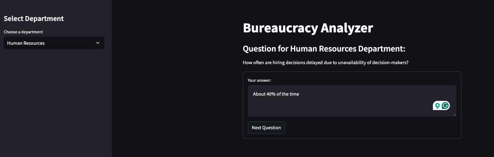
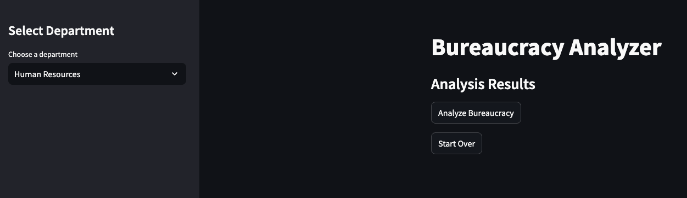
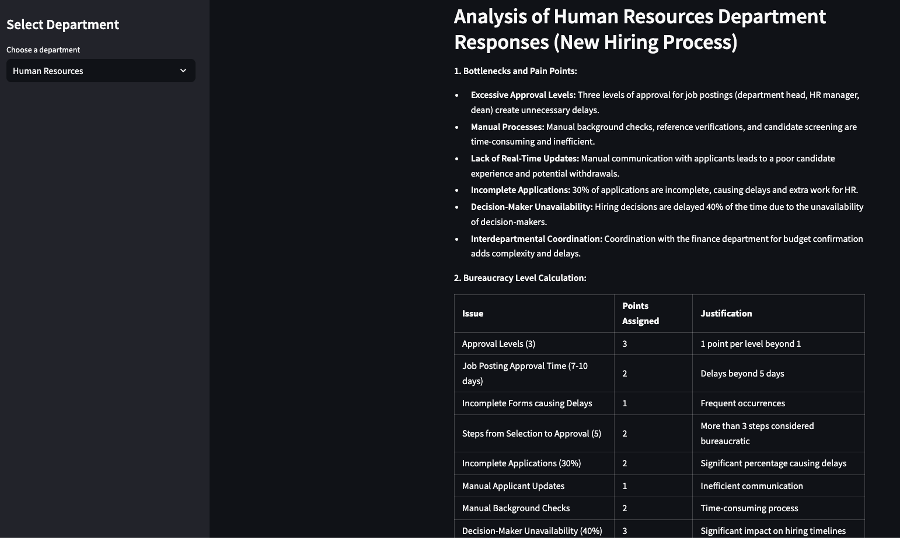
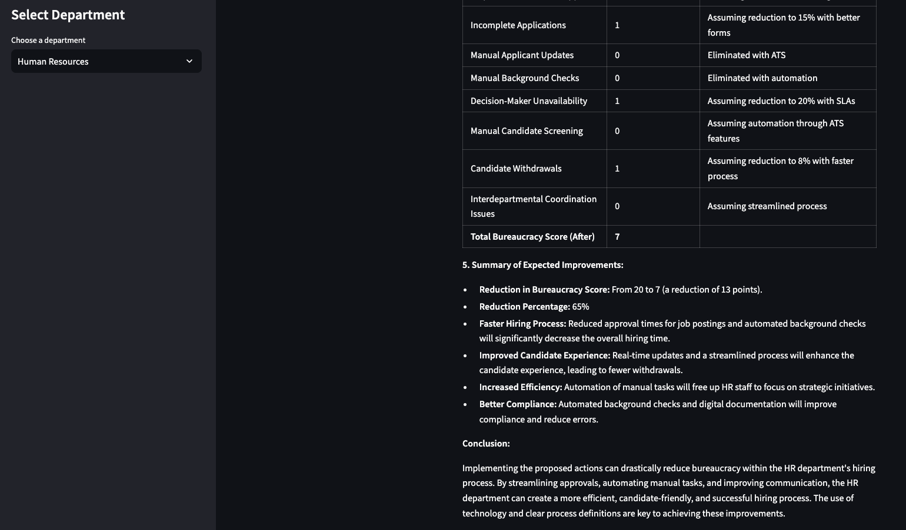
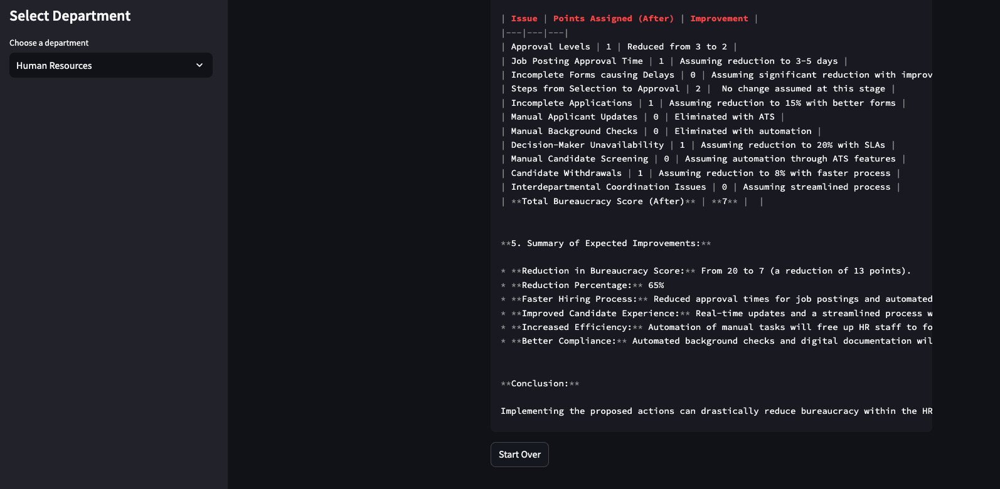

# Bureaucracy Analyzer

## Overview

The Bureaucracy Analyzer is a Streamlit application designed to assist users in analyzing different departments within an organization. It allows users to interactively respond to questions posed by each department and then generates an analysis based on those responses.

## Features

1. **Department Selection**: Users can select between the Human Resources (HR) and Finance departments.
2. **Interactive Questions**: The application presents questions relevant to the selected department, and users can input their answers.
3. **Next Question**: Answers are submitted through a form, and the application updates dynamically to move to the next question once an answer is provided.
4. **Analyze Bureaucracy**: After completing all questions, users can initiate an analysis which provides insights based on the collected data.
5. **Start Over**: Users have the option to start over from the beginning.

## Installation

To run this application locally, you need to have Python installed on your machine. Follow these steps:

1. Clone the repository:

   ```bash
   git clone https://github.com/your-repo/bureaucracy-analyzer.git
   ```

2. Navigate to the project directory:

   ```bash
   cd bureaucracy-analyzer
   ```

3. Install the required dependencies:
   ```bash
   conda create -n bureaucracy_analyzer python=3.12
   conda activate bureaucracy_analyzer
   pip install -r requirements.txt
   ```

## Usage

1. Run the Streamlit app:

   ```bash
   streamlit run app.py
   ```

2. Open your web browser and navigate to `http://localhost:8501` to access the Bureaucracy Analyzer.

Sample Question from HR Department:



After submitting all answers:



Answers Generated:





Markdown also included to make the analysis copying more easier.



## Directory Structure

```
bureaucracy-genai/
├── app.py
├── .env
├── .envexample
├── .gitignore
├── README.md
├── requirements.txt
├── data/
│   ├── sample.txt
├── screenshots/
│   ├── 1.png
│   ├── 2.png
│   .
│   .
│   .
├── bureaucracy/
│   ├── __init__.py
│   ├── bureaucracy_analyze.py
│   ├── constants.py
│   └── department.py
└── utilities/
    ├── __init__.py
    └── helper.py
```

## Contributing

Contributions are welcome! If you find any issues or want to add new features, please open an issue or submit a pull request.

Note: This README file is generated using: https://huggingface.co/spaces/yasserrmd/ReadMeForge.

## License

This project is licensed under the MIT License - see the [LICENSE](LICENSE) file for details.

---

Feel free to modify and expand upon this README to better suit your specific needs.
